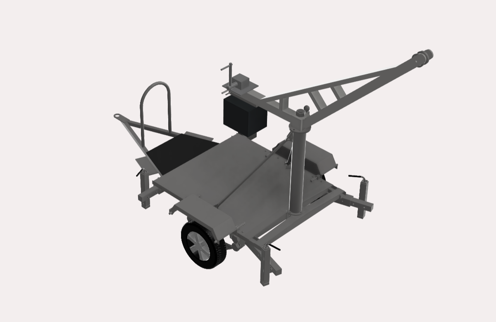
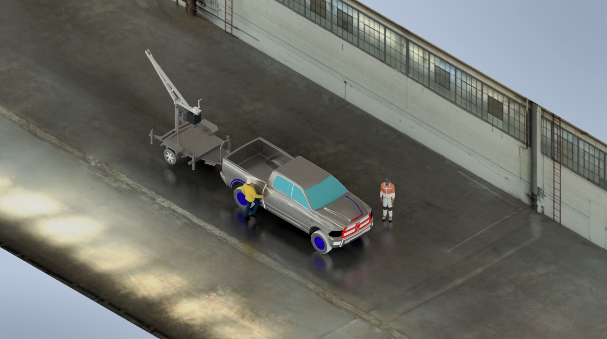
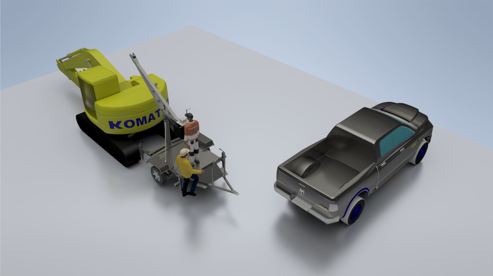

# Portable Crane Prototype for Excavator Komatsu PC200

This is a prototype design for a portable crane intended to facilitate the overhaul of a Komatsu PC200 excavator engine, especially in forested areas where lifting the engine can be challenging if the excavator breaks down.

This prototype was made during an internship at PT United Tractors, Tbk, June 2019.

The crane's structure is made of SS400 steel and is equipped with four trailer jacks, a winch, and a pulley system capable of lifting up to 1.5 tons. It also features a 600 kg counterweight for stability.

The portable crane is designed to be towed by a mid-sized pickup truck, such as the Mitsubishi Triton, enhancing its mobility and ease of use in remote locations.

